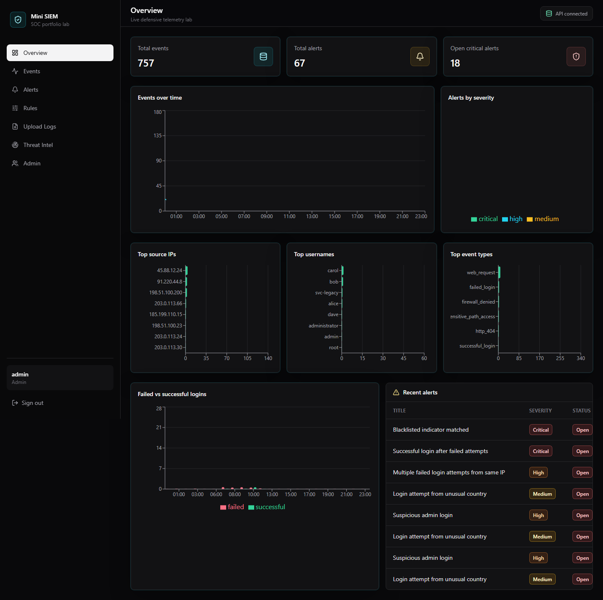
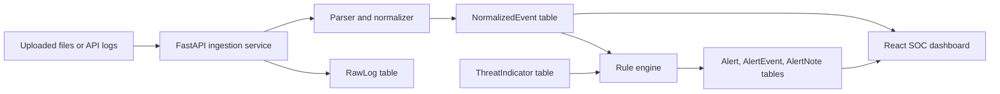

# Mini SIEM Dashboard

A production-style, defensive Security Information and Event Management dashboard for a cybersecurity portfolio. It ingests safe simulated logs, normalizes them into a searchable event schema, evaluates detection rules, generates alerts, and presents the workflow in a modern SOC-style web app.

This project is educational and defensive. It does not include exploitation, malware, credential theft, or attack automation. Suspicious activity is represented only as fake logs and simulated telemetry.

## Screenshots



Suggested additions after expanding the project:

- Events investigation drawer
- Alert timeline with analyst notes
- Detection rules and threat intelligence pages

## Features

- JSON, CSV, TXT, and LOG upload support with file type and size validation
- API log ingestion for structured events and raw lines
- Raw log storage separated from normalized events
- Parsers for SSH auth logs, web access logs, app login JSONL, firewall-like events, CSV, and generic text
- Normalized SIEM-style event model for search, filtering, correlation, and alerting
- Built-in detection rules for failed logins, success after failures, admin logins, unusual countries, 404 spikes, directory probing, sensitive path access, request bursts, suspicious user agents, denied firewall spikes, and blacklist matches
- Alert management with status updates, analyst notes, related events, and investigation timeline
- Local threat intelligence indicators for IPs, domains, and usernames
- Role-based access control for admin, analyst, and viewer users
- Dark SOC dashboard with Recharts visualizations, filters, badges, loading states, empty states, and toast notifications
- Demo data seeding with 500+ generated events and many realistic alerts
- Docker Compose for PostgreSQL, FastAPI, and Vite

## Tech Stack

- Frontend: React, TypeScript, Vite, Tailwind CSS, Recharts, Axios, Lucide icons
- Backend: Python, FastAPI, SQLAlchemy, Pydantic, JWT, bcrypt
- Database: PostgreSQL
- Migrations: Alembic
- Packaging: Docker Compose

## Architecture



The backend keeps ingestion, parsing, rules, auth, schemas, and API routes in separate modules. The frontend uses a typed API client and reusable UI primitives for metrics, badges, protected routes, toasts, and investigation panels.

## Database Schema Overview

- `User`: username, email, hashed password, role
- `RawLog`: original uploaded or API-submitted content
- `NormalizedEvent`: timestamp, source and destination IP, username, hostname, event type, category, severity, message, HTTP fields, geo country, raw line
- `DetectionRule`: name, description, severity, enabled flag, JSON conditions, threshold, time window
- `Alert`: title, severity, status, source IP, affected user, first and last seen, event count
- `AlertEvent`: alert-to-event relationship
- `AlertNote`: analyst notes on alerts
- `ThreatIndicator`: local blacklist values for IPs, domains, and usernames

## API Endpoints

- `POST /api/auth/register`
- `POST /api/auth/login`
- `GET /api/dashboard/summary`
- `POST /api/logs/upload`
- `POST /api/logs/ingest`
- `GET /api/events`
- `GET /api/events/{id}`
- `GET /api/alerts`
- `GET /api/alerts/{id}`
- `PATCH /api/alerts/{id}/status`
- `POST /api/alerts/{id}/notes`
- `GET /api/rules`
- `PATCH /api/rules/{id}/toggle`
- `POST /api/rules`
- `GET /api/threat-intel`
- `POST /api/threat-intel`
- `PATCH /api/threat-intel/{id}`
- `DELETE /api/threat-intel/{id}`
- `GET /api/admin/stats`
- `GET /api/admin/users`
- `POST /api/admin/users`
- `PATCH /api/admin/users/{id}`
- `POST /api/demo/seed`
- `DELETE /api/demo/clear`

Interactive API docs are available at `http://localhost:8000/api/docs`.

## Quick Start With Docker

```bash
docker compose up --build
```

Then open:

- Frontend: `http://localhost:5173`
- Backend API: `http://localhost:8000`
- API docs: `http://localhost:8000/api/docs`

The backend creates tables on startup in local development and ensures demo login users, built-in rules, and baseline indicators exist.

## Local Development Without Docker

Start PostgreSQL locally and create a database named `mini_siem`, then run:

```bash
cd backend
python -m venv .venv
.venv\Scripts\activate
pip install -r requirements.txt
copy .env.example .env
uvicorn app.main:app --reload
```

In another terminal:

```bash
cd frontend
npm install
copy .env.example .env
npm run dev
```

## Environment Variables

Backend:

- `DATABASE_URL`: SQLAlchemy PostgreSQL connection URL
- `JWT_SECRET_KEY`: long random secret for JWT signing
- `JWT_EXPIRE_MINUTES`: token lifetime
- `CORS_ORIGINS`: JSON list of allowed frontend origins
- `MAX_UPLOAD_BYTES`: upload size limit
- `AUTO_CREATE_TABLES`: local development table creation toggle

Frontend:

- `VITE_API_URL`: API base URL, for example `http://localhost:8000/api`

## Demo Login Credentials

- Admin: `admin` / `AdminPass123!`
- Analyst: `analyst` / `AnalystPass123!`
- Viewer: `viewer` / `ViewerPass123!`

Use the Admin page to seed or clear demo telemetry.

## Sample Logs

Sample files are included in `backend/sample_logs` and exposed for download in the Upload Logs page:

- `ssh_auth.log`
- `web_access.log`
- `firewall.log`
- `application_logins.jsonl`

Upload any sample file as an admin or analyst. The backend stores the raw content, normalizes parsed lines, evaluates enabled rules, and returns a preview plus parse errors.

## Detection Rules

Rules are stored in the database and evaluated whenever new normalized events are created. A rule defines:

- JSON conditions
- grouping fields such as `source_ip` or `username`
- threshold
- time window
- severity
- enabled state

The rule engine checks recent events inside the configured window, links related events to matching alerts, and updates active alerts instead of creating duplicates when the same investigation is already open.

Custom rules created in the UI use a simple threshold pattern over an event type grouped by source IP.

## Roles and Permissions

- Admin: manage users, rules, threat indicators, and demo data
- Analyst: upload logs, update alert status, and add analyst notes
- Viewer: view dashboards, events, alerts, rules, and threat indicators

## Security Notes

- Passwords are hashed with bcrypt through Passlib
- JWTs are signed server-side and never logged
- Uploads are restricted by extension and size
- Uploaded text is sanitized before storage
- Frontend secrets are not embedded in code
- CORS is configured through environment variables
- Demo data uses reserved documentation IP ranges and fake users only

This project is not a replacement for a production SIEM. It is a safe learning and portfolio system for defensive log analysis workflows.

## Roadmap

- Add full-text search indexes
- Add Celery workers for large ingestion batches
- Add saved searches and case management
- Add CSV export for events and alerts
- Add automated backend tests and Playwright UI smoke tests
- Add OpenTelemetry instrumentation
- Add rule simulation mode before enabling custom rules

## License

MIT
