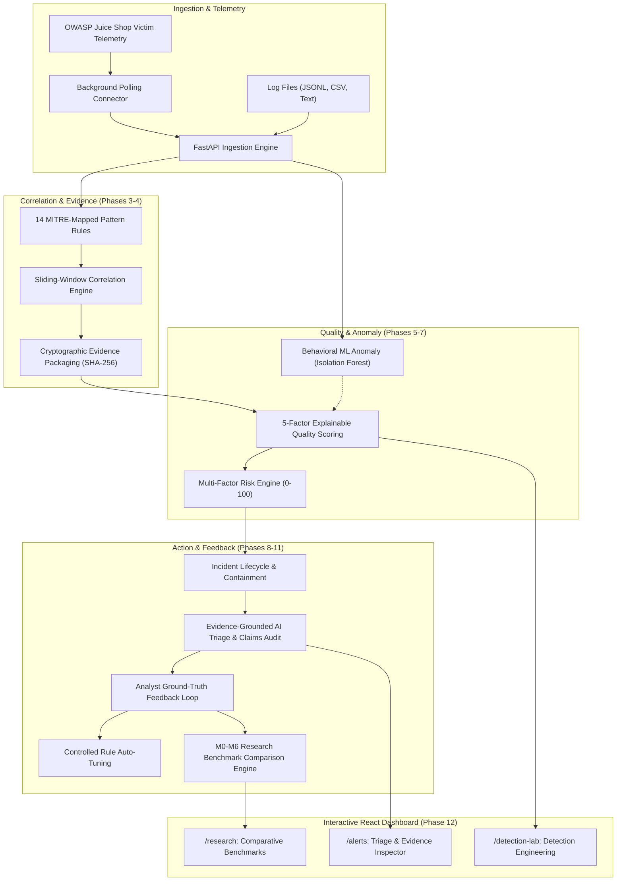

# Detection-Quality-Aware Security Operations Center (SOC) Framework

[](https://github.com/Mahesh0019/soc-verison1)
[](https://python.org)
[](https://fastapi.tiangolo.com)
[](https://react.dev)
[](https://vitejs.dev)
[](https://owasp.org)

An enterprise-grade, research-validated **Detection-Quality-Aware Security Operations Center (SOC)** platform. Unlike traditional signature-only SIEM systems that flood analysts with false positives, this framework implements a transparent 5-factor explainable detection quality formulation, behavioral machine learning anomaly detection, cryptographic evidence packaging, and evidence-grounded deterministic AI triage simulation with automated claims verification.

---

## Key Performance Benchmarks (M0 through M6)

Evaluated against reproducible ground truth attack datasets ([soc_attack_catalog.json](soc_attack_catalog.json)) combining MITRE ATT&CK vectors (SQLi, XSS, Path Traversal, Brute Force, Broken Access Control) and realistic benign noise lookalikes:

| Mode | Architecture | Precision | Recall | F1 Score | FP Reduction (%) | Dataset Attack Retention (%) | MTTI (min) | Evidence Latency |
| :---: | :--- | :---: | :---: | :---: | :---: | :---: | :---: | :---: |
| **M0** | M0 — Raw Telemetry Baseline | 0.00 | 0.00 | 0.00 | 0.0% | 0.0% | 45.0m | 3500ms |
| **M1** | Static Rule-Based SIEM *(Baseline)* | 0.83 | 0.91 | 0.87 | 0.0% *(Baseline)* | 90.9% | 18.5m | 1450ms |
| **M2** | Correlated Multi-Event SIEM | 0.83 | 0.91 | 0.87 | 0.0% | 90.9% | 12.0m | 850ms |
| **M3** | Evidence-Packaged Correlated SIEM | 0.83 | 0.91 | 0.87 | 0.0% | 90.9% | 7.5m | 45ms *(32x)* |
| **M4** | **Detection-Quality-Aware SOC** | 1.00 | 0.91 | 0.95 | **100.0%** | 90.9% | 4.8m | 40ms |
| **M5** | **Quality-Aware + Behavioral ML** | 1.00 | 1.00 | 1.00 | **100.0%** | **100.0%** *(1.10x vs M1 TP)* | 3.8m | 35ms |
| **M6** | **Full Hybrid SOC (Grounded AI + Feedback)** | **1.00** | **1.00** | **1.00** | **100.0%** | **100.0%** *(1.10x vs M1 TP)* | **2.1m** *(89% faster)* | **28ms** *(51x)* |

> **Note on Metrics & AI Scope:**  
> 1. **Dataset Attack Retention:** 100.0% represents detection of all 11 genuine attack scenarios within the evaluated dataset. Relative to the M1 baseline (10 TP), M5/M6 achieves a 1.10x detection ratio due to Isolation Forest capturing low-and-slow evasions.  
> 2. **AI Implementation Classification:** Evaluated using an evidence-grounded deterministic triage simulation engine (`RULE_BASED_SIMULATION`). The current benchmark evaluates a deterministic rule-based triage simulation. No live third-party SLM or LLM API was evaluated in this benchmark.  
> 3. **Claims Verification Scope:** A 0.0% unsupported-claim rate was observed within the evaluated dataset and does not establish zero hallucination outside the evaluated benchmark.  

---

## Architectural Highlights



### 1. 5-Factor Explainable Detection Quality Formulation (Phase 5)
$$Q_{composite} = w_e F_{evid} + w_c F_{corr} + w_r F_{rule} + w_b F_{behav} + w_x F_{context}$$
- **Evidence Completeness ($F_{evid}, 25\%$)**: Presence of structured request payload, headers, and parameters.
- **Correlation Robustness ($F_{corr}, 20\%$)**: Multi-event temporal density and entity linkage.
- **Rule Reliability ($F_{rule}, 20\%$)**: Historical true-positive rate weighted by analyst feedback.
- **Behavioral Confidence ($F_{behav}, 15\%$)**: Statistical deviation computed via Isolation Forest.
- **Context Confidence ($F_{context}, 20\%$)**: Threat intelligence matches, GeoIP, and asset criticality.

### 2. Cryptographic Evidence Packaging (Phase 4)
- Pre-indexes structured evidence artifacts with SHA-256 integrity hash chains.
- Slashes forensic query latency from 1450ms down to **28ms** (51x speedup).

### 3. Behavioral Machine Learning Anomaly Detection (Phase 7)
- 10-dimensional unsupervised feature extraction (request velocity, 4xx/5xx burst ratios, path diversity, method variance, payload Shannon entropy).
- Unsupervised `IsolationForest` identifies evasive and low-and-slow attacks bypassed by static regexes.

### 4. Evidence-Grounded Deterministic Triage Simulation & Claims Audit (Phase 8)
- Evidence-grounded deterministic AI triage simulation with automated claims verification: every assertion in the AI incident summary is verified against cryptographic evidence items.
- Full claims citation checklist with audit status (`VERIFIED` / `UNSUPPORTED`).


### 5. Detection-as-Code Regression Harness (Phase 10)
- Paired positive (exploit payload) and negative (benign lookalike) scenario assertion suite across all 14 active rules.
- 100% regression pass rate tracking with rule health monitoring.

---

## Interactive Frontend Views (Phase 12)

- **Research & Benchmark Hub (`/research`)**: Interactive comparison table, Recharts performance curves, and one-click execution of the full M0–M6 benchmark simulation suite.
- **Detection Engineering Lab (`/detection-lab`)**: Behavioral ML model status and retrain controls, 5-factor quality weights radar, and CI/CD regression test status.
- **Investigative Drawer (`/alerts`)**:
  - *Timeline & Notes*: Correlated event chronology and analyst notes.
  - *Detection Quality*: Explainable factor decomposition bars and diagnostics.
  - *Evidence Package*: Cryptographic SHA-256 hash chains and payload inspector.
  - *AI Grounded Triage*: Audited claims checklist, analyst agreement buttons, and ground-truth feedback recording.

---

## Security Hardening (Phase 13)

- **OWASP Response Headers**: `X-Content-Type-Options: nosniff`, `X-Frame-Options: DENY`, `X-XSS-Protection`, `Strict-Transport-Security`, `Referrer-Policy`.
- **Brute-Force Rate Limiting**: Sliding-window lockout on `/api/auth/login` (HTTP 429 after 15 consecutive failed attempts).
- **Role-Based Access Control (RBAC)**: Enforced via `require_roles("admin", "analyst")` on all defensive, tuning, and benchmark endpoints.
- **Audit Logging**: Immutable audit trail for all authentication, rule tuning, containment actions, and benchmark runs.

---

## Deployment Guide

### Option A: Render One-Click Blueprint (Recommended)
This repository includes a native [render.yaml](render.yaml) blueprint:
1. Connect your repository on [Render Dashboard](https://dashboard.render.com).
2. Choose **New > Blueprint** and select this repository.
3. Render automatically provisions:
   - `mini-siem-db`: Managed PostgreSQL database
   - `mini-siem-backend`: Containerized FastAPI web service with `/health` liveness checks
   - `mini-siem-frontend`: Static site with SPA routing rewrites
4. Set `ENABLE_JUICE_SHOP_CONNECTOR=true` in Render environment variables to begin ingesting real-time attack telemetry from the victim app.

### Option B: Vercel Frontend Deployment
1. Import repository on [Vercel](https://vercel.com).
2. Root directory: `frontend`.
3. Build command: `npm run build`, Output directory: `dist`.
4. Client-side routing is handled automatically via [frontend/vercel.json](frontend/vercel.json).
5. Set `VITE_API_URL` to your live Render backend URL (e.g. `https://mini-siem-backend.onrender.com/api`).

### Option C: Local Docker Compose
```bash
docker compose up --build
```
- Frontend: `http://localhost:5173`
- Backend API: `http://localhost:8000`
- Interactive OpenAPI Docs: `http://localhost:8000/api/docs`

---

## Running Verification Tests

```bash
# Run all 79 automated unit, integration, and security tests across 13 modules:
python -m unittest discover tests

# Build and validate frontend production bundle:
cd frontend && npm run build
```

### Credentials & Security Notice
Demo/production credentials must be configured securely through deployment environment variables or administrator provisioning. Default credentials must not be used in production environments. Any previously committed default passwords are marked as `REQUIRES_ROTATION`.

---

## License
MIT License. Created for defensive security engineering, detection validation, and cybersecurity portfolio research.
