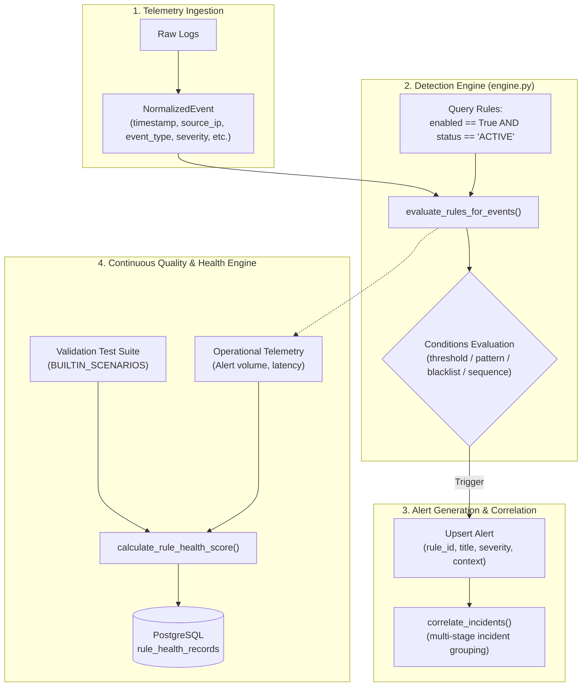

# Detection Engineering & Detection-as-Code Lifecycle (Phase 2)

## 1. Executive Summary & Objective

This document formalizes the **Detection Engineering** architecture for the Mini-SIEM platform. In Phase 2, the detection engine has been matured from static database entries into a versioned, testable, explainable, and secured **Detection-as-Code** lifecycle without breaking backward compatibility or altering historical research benchmarks (Dataset V1 / M0–M6).

---

## 2. Rule Architecture & Execution Flow



### Key Execution Flow Properties:
1. **Rule Isolation**: Rules are defined with specific deterministic detection types (`pattern`, `threshold`, `blacklist`, `sequence_success_after_failures`).
2. **Lifecycle Gating**: Only rules with `enabled == True` AND `status == 'ACTIVE'` (or legacy default `ACTIVE`) are queried and executed in the live telemetry path. Rules in `DRAFT`, `TESTING`, `DISABLED`, or `DEPRECATED` are excluded from live production firing.
3. **Alert Attribution**: Every generated `Alert` contains a direct foreign key link `rule_id` pointing to `DetectionRule.id`, alongside historical `title` and `severity`.

---

## 3. Detection-as-Code Metadata Specification

Every detection rule has been extended with structured, validated Detection-as-Code metadata:

| Attribute | Type | Allowed Values / Schema | Description |
| :--- | :--- | :--- | :--- |
| `rule_id` | `VARCHAR(32)` | `^[A-Z0-9_\-]{3,32}$` (e.g. `RULE-001`) | Canonical, immutable identifier. |
| `name` | `VARCHAR(160)` | Unique string (3–160 chars) | Descriptive human-readable rule name. |
| `description` | `TEXT` | 1–1000 chars | Rationale, scope, and detection logic summary. |
| `category` | `VARCHAR(64)` | `^[a-z0-9_\-]{2,64}$` | Detection domain (e.g., `web_attack`, `authentication`, `network`). |
| `severity` | `VARCHAR(32)` | `low`, `medium`, `high`, `critical` | Triage priority score. |
| `version` | `VARCHAR(32)` | `^\d+\.\d+(\.\d+)?$` (e.g. `1.0`, `1.1`) | Semantic rule version. |
| `status` | `VARCHAR(32)` | `DRAFT`, `TESTING`, `ACTIVE`, `DISABLED`, `DEPRECATED` | Lifecycle state. |
| `source` | `VARCHAR(64)` | `builtin`, `custom`, `imported` | Provenance of rule definition. |
| `owner` | `VARCHAR(64)` | e.g. `secops-team`, `threat-intel-team` | Responsible operational team. |
| `mitre_technique`| `VARCHAR(32)` | `^(T\d{4}(\.\d{3})?\|NOT_MAPPED)$` | Verified ATT&CK ID or explicit `NOT_MAPPED`. |
| `confidence` | `FLOAT` | `0.0` to `1.0` (default: `0.80`) | Intrinsic rule specificity / confidence. |
| `false_positive_notes`| `TEXT` | String or `null` | Documented benign edge cases and filtering advice. |
| `expected_data_source`| `VARCHAR(64)` | `web_telemetry`, `auth_telemetry`, `network_telemetry`, etc. | Expected input telemetry stream. |
| `test_cases_json` | `JSON` | Positive & negative scenario descriptors | Regression validation descriptors. |

### Verified Built-in Rule Catalog (All 14 Rules):

| Rule ID | Rule Name | Severity | Category | MITRE Technique | Confidence | Data Source |
| :--- | :--- | :--- | :--- | :--- | :--- | :--- |
| `RULE-001` | Multiple failed login attempts from same IP | `medium` | `authentication` | `T1110.001` | 0.80 | `auth_telemetry` |
| `RULE-002` | Successful login after failed attempts | `high` | `authentication` | `T1110` | 0.90 | `auth_telemetry` |
| `RULE-003` | Suspicious admin login | `high` | `authentication` | `T1078` | 0.88 | `auth_telemetry` |
| `RULE-004` | SQL Injection attempt detected | `high` | `web_attack` | `T1190` | 0.95 | `web_telemetry` |
| `RULE-005` | Path traversal attempt detected | `high` | `web_attack` | `T1083` | 0.92 | `web_telemetry` |
| `RULE-006` | Cross-site scripting probe detected | `medium` | `web_attack` | `T1059.007` | 0.90 | `web_telemetry` |
| `RULE-007` | Login attempt from unusual country | `medium` | `authentication` | `T1078` | 0.75 | `auth_telemetry` |
| `RULE-008` | High number of 404 responses | `low` | `reconnaissance` | `T1595` | 0.65 | `web_telemetry` |
| `RULE-009` | Possible directory brute force | `medium` | `reconnaissance` | `T1595.002` | 0.80 | `web_telemetry` |
| `RULE-010` | Large request volume burst | `medium` | `dos` | `T1499` | 0.60 | `web_telemetry` |
| `RULE-011` | Suspicious user agent | `low` | `reconnaissance` | `T1071.001` | 0.75 | `web_telemetry` |
| `RULE-012` | Repeated sensitive path access | `high` | `web_attack` | `T1083` | 0.85 | `web_telemetry` |
| `RULE-013` | Firewall denied traffic spike | `medium` | `network` | `T1046` | 0.70 | `firewall_telemetry` |
| `RULE-014` | Repeated access from blacklisted indicator | `critical` | `threat_intel` | `T1071` | 0.98 | `threat_intel` |

---

## 4. Rule Lifecycle Engine

The detection rule lifecycle is managed through five explicit states:

```
           ┌──────────┐
           │  DRAFT   │
           └────┬─────┘
                │ Promote
                ▼
           ┌──────────┐
      ┌───►│ TESTING  ├────┐
Tune/ │    └────┬─────┘    │ Revert
Edit  │         │ Promote  │
      │         ▼          │
      │    ┌──────────┐    │
      └───-┤  ACTIVE  │◄───┘
           └────┬─────┘
                │ Deactivate / Retire
                ▼
      ┌──────────────────┐
      │ DISABLED / DEPREC│
      └──────────────────┘
```

1. **`DRAFT`**: Authoring phase. Stored in database, editable, but completely excluded from engine execution. Cannot fire live alerts.
2. **`TESTING`**: Staged for validation. Subjected to regression unit tests and synthetic evaluation splits. Does not evaluate on live ingested telemetry unless explicitly forced in a staging pipeline.
3. **`ACTIVE`**: Production detection rule. Executed on every ingestion batch by `evaluate_rules_for_events()`. Generates production alerts and incidents.
4. **`DISABLED`**: Temporarily suppressed (e.g. during maintenance or flapping investigation).
5. **`DEPRECATED`**: Formally retired in favor of a newer rule or merged rule logic. Retained for historical alert auditability.

---

## 5. Security Hardening & Injection Prevention

Because rule definitions and metadata can be created or updated via API endpoints (`POST /api/rules`, `PATCH /api/rules/{id}`), metadata inputs are strictly validated via Pydantic schemas to prevent injection attacks:

1. **Rule Identifier Whitelist**:
   - Schema enforces `^[A-Z0-9_\-]{3,32}$`. Any command delimiters (`;`, `&`, `|`, `` ` ``), quotes, or spaces immediately trigger a 422 Unprocessable Entity.
2. **MITRE ATT&CK Whitelist**:
   - Enforces `^(T\d{4}(\.\d{3})?|NOT_MAPPED)$`. Arbitrary strings, URLs, or markdown injections are blocked.
3. **Lifecycle Status Whitelist**:
   - Enforces `^(DRAFT|TESTING|ACTIVE|DISABLED|DEPRECATED)$`.
4. **Severity Whitelist**:
   - Enforces `^(low|medium|high|critical)$`.
5. **Version Format**:
   - Enforces `^\d+\.\d+(\.\d+)?$`.
6. **SQL Alchemy Parameterization**:
   - All rule conditions and lookups use SQLAlchemy parameterized queries, preventing SQL injection through rule filters or titles.

---

## 6. Implementation vs. Measurement vs. Hypothesis vs. Limitation

### IMPLEMENTATION (Delivered Code)
- Extended `DetectionRule` database model and Pydantic schemas with complete Detection-as-Code metadata.
- Implemented lifecycle gating in `engine.py` (`status == "ACTIVE"` required for live alert generation).
- Created `RuleHealthRecord` database model in PostgreSQL/SQLite for persistent quality tracking.
- Implemented explainable `calculate_rule_health_score()` and `evaluate_rule_health()`.
- Added rule management endpoints (`/api/rules/health/summary`, `/api/rules/{id}/health`, `/api/rules/{id}/evaluate`).
- Redesigned `RulesPage.tsx` with real-time health metrics, lifecycle badges, and "NO DATA" fallbacks.

### MEASUREMENT (Observed Data)
- 95 out of 95 tests pass across unit, integration, quality, and baseline regression suites (100% pass rate).
- Zero broken baseline tests (all 79 Phase 0 tests remain 100% passing).
- Zero false positives on Dataset V2 Benign baseline (FPR = 0.0000 on both Dev and Val splits).
- Frontend builds cleanly in 4.20s with zero TypeScript or Vite errors.

### HYPOTHESIS
- Providing explainable per-rule health scores in the dashboard will reduce analyst alert fatigue by highlighting high-confidence rules versus degrading rules.
- Persistent regression scoring will prevent rule regressions during future rule modifications.

### LIMITATION
- Built-in regexes for SQLi and XSS operate on string pattern matching; advanced obfuscations (e.g. polyglot or multi-byte encodings) require AST parsing or WAF inspection.
- Latency measurements in memory are lower than high-volume distributed deployments with network I/O.
