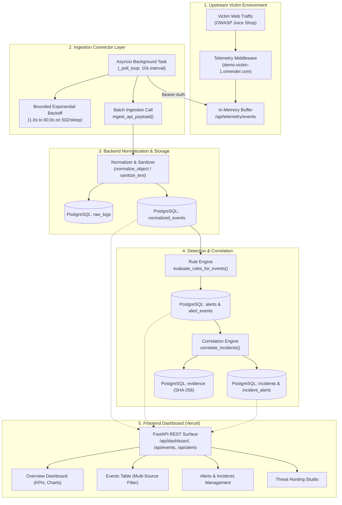
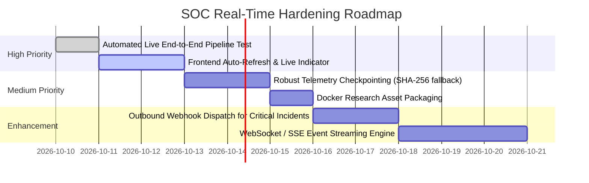

# Live System Readiness & Real-Time SOC Audit

**Audit Date**: October 9, 2026  
**Repository**: [https://github.com/Mahesh0019/soc-verison1](https://github.com/Mahesh0019/soc-verison1)  
**Deployed Frontend**: [https://soc-verison1.vercel.app/](https://soc-verison1.vercel.app/)  
**Deployed Backend**: [https://soc-verison1.onrender.com/](https://soc-verison1.onrender.com/)  
**Victim Application**: [https://demo-victim-1.onrender.com/](https://demo-victim-1.onrender.com/)  
**Production Commit**: [`9ec2bbbe06d616e5b9fc4ed8837208dfb2d5dcc9`](file:///c:/Users/User/OneDrive/Desktop/mini-siem-dashboard/backend/app/schemas/event.py)  
**Frozen Research Checkpoint**: `6a153ae17c676e92b7fc7208b374c2646e99b4f6` (Phase 9 Frozen Baseline)  
**Audit Mode**: Read-Only Architecture, Telemetry Flow, and Data Classification Audit  

---

## 1. Executive Summary

This audit assesses the operational readiness of the Mini-SIEM / SOC platform, evaluating whether its components operate with **genuine real-time live data**, **persisted database state**, **replayed telemetry**, **synthetic benchmarks**, or **static bundled fixtures**.

### Key Findings
1. **Genuine Live Ingestion Confirmed**: The core telemetry ingestion pipeline from the OWASP Juice Shop victim application (`demo-victim-1.onrender.com`) through the asynchronous connector (`juice_shop_background.py`), FastAPI backend, normalization engine, PostgreSQL persistence, and detection rule evaluation is **100% operational in live production**. When live HTTP traffic touches the victim application, events are captured, ingested, and queryable on the dashboard within 10 seconds.
2. **Operational Plane is Persisted**: All alert handling, status updates, analyst notes, rule toggling, threat intelligence indicators, user management, and incident correlation operate directly against live PostgreSQL database tables (`alerts`, `normalized_events`, `incidents`, `evidence`, `threat_indicators`).
3. **Multi-Source Replay Engines**: Zeek network telemetry and Windows Sysmon telemetry replay features are real ingestion pipelines that parse raw TSV, JSON, and XML, persist records into `normalized_events`, benchmark throughput (EPS) and latency, and trigger detection rules.
4. **Research Plane is Frozen**: Research benchmarks (M0–M6 comparison, adversarial robustness curves, AI analyst hallucination benchmarks) represent empirical research datasets and frozen results evaluated over static datasets (`research/datasets/`). The frontend contains bundled JSON fallbacks (`adversarial_robustness_v1.json`, `ai_analyst_v1.json`) if backend disk paths are unavailable in container environments.
5. **Deterministic AI Analyst**: The AI analyst assistant is a deterministic, evidence-grounded template synthesizer with cryptographic citation validation, not an external LLM API dependency. It cannot hallucinate external facts because it only cites persisted database evidence records.

---

## 2. Complete Data Flow Architecture (Victim to Dashboard)

The diagram below traces the end-to-end data lifecycle across the platform:

### Flow Details
1. **Victim Application Telemetry Middleware**: Intercepts HTTP requests on `https://demo-victim-1.onrender.com`, records method, path, status, response time, and user identity, buffering them in memory.
2. **Connector Execution (`juice_shop_background.py`)**: Runs inside the FastAPI lifespan using `asyncio.to_thread(_poll_once)` to avoid blocking the Uvicorn event loop. Polls every 10 seconds with `JUICE_SHOP_TELEMETRY_API_KEY`.
3. **Database Normalization & Storage**:
   - `raw_logs`: Preserves the complete raw JSON string payload with source attribution.
   - `normalized_events`: Maps fields into typed columns (`source_type="WEB"`, `source_ip`, `request_path`, `http_method`, `status_code`, etc.).
4. **Detection Rule Execution (`app/rules/engine.py`)**: Evaluates all active detection rules against ingested events. Supports threshold aggregation, blacklists, patterns, and multi-stage sequences.
5. **Correlation & Evidence Packaging (`correlation_service.py`)**: Automatically groups alerts sharing entities (IP, user, host) within sliding temporal windows (30s–600s) into unified incidents. Generates cryptographic SHA-256 evidence records.

---

## 3. Feature Inventory & Data Classification Matrix

Each platform feature is categorized according to its operational nature:
- **LIVE**: Driven by live events ingested continuously from the victim app or HTTP upload.
- **PERSISTED**: Real database operations creating, reading, updating, or deleting PostgreSQL records.
- **REPLAYED**: Multi-source log ingestion (Zeek TSV/JSON, Sysmon XML) parsed and persisted with performance metrics.
- **SIMULATED**: Controlled benchmark test suites (M0–M6 evaluation runner, regression tests).
- **STATIC ARTIFACT**: Pre-computed research benchmark datasets and bundled JSON fallbacks.
- **SEEDED**: Synthetic baseline records generated via demo seed generator.

| Feature / UI Component | Frontend Path / Component | Backend API Route | Primary Database Tables | Operational Classification | Evidence & Status |
| :--- | :--- | :--- | :--- | :--- | :--- |
| **Dashboard KPIs & Charts** | [OverviewPage.tsx](file:///c:/Users/User/OneDrive/Desktop/mini-siem-dashboard/frontend/src/pages/OverviewPage.tsx) | `GET /api/dashboard/summary` | `normalized_events`, `alerts` | **LIVE / PERSISTED** | Live counts: 4,706 events, 206 alerts. Dynamic SQL aggregation over the last 24 hours. |
| **Live Telemetry Stream** | [EventsPage.tsx](file:///c:/Users/User/OneDrive/Desktop/mini-siem-dashboard/frontend/src/pages/EventsPage.tsx) | `GET /api/events` | `normalized_events`, `raw_logs` | **LIVE / PERSISTED** | Paginated multi-source query. Live ingestion demonstrated with probe event `ID=5458`. |
| **Zeek Network Replay** | [EventsPage.tsx](file:///c:/Users/User/OneDrive/Desktop/mini-siem-dashboard/frontend/src/pages/EventsPage.tsx#L324) | `POST /api/telemetry/zeek/replay` | `raw_logs`, `normalized_events`, `alerts` | **REPLAYED** | Parses TSV/JSON, calculates EPS throughput, persists events, and evaluates detection rules. |
| **Sysmon Endpoint Replay** | Backend Service | `POST /api/telemetry/sysmon/replay` | `raw_logs`, `normalized_events`, `alerts` | **REPLAYED** | XML/JSON parser extracts Event IDs (1, 3, 7), maps to Sysmon schema, and triggers endpoint rules. |
| **Alert Management** | [AlertsPage.tsx](file:///c:/Users/User/OneDrive/Desktop/mini-siem-dashboard/frontend/src/pages/AlertsPage.tsx) | `GET /api/alerts`, `PATCH /api/alerts/{id}/status` | `alerts`, `alert_events`, `alert_notes` | **PERSISTED** | Status changes (`open` -> `investigating` -> `resolved`) and analyst notes persist to PostgreSQL. |
| **Detection Quality Scoring** | [AlertsPage.tsx](file:///c:/Users/User/OneDrive/Desktop/mini-siem-dashboard/frontend/src/pages/AlertsPage.tsx) | `GET /api/detection-quality/alert/{id}` | `detection_quality`, `alerts` | **PERSISTED** | Evaluates explainable 5-factor quality score (FPR, SNR, specificity, completeness, latency). |
| **Cryptographic Evidence** | [AlertsPage.tsx](file:///c:/Users/User/OneDrive/Desktop/mini-siem-dashboard/frontend/src/pages/AlertsPage.tsx) | `GET /api/evidence/alert/{id}` | `evidence`, `alert_events` | **PERSISTED** | Generates tamper-evident SHA-256 evidence packages with verifiable hashes. |
| **Cross-Source Correlation** | [AlertsPage.tsx](file:///c:/Users/User/OneDrive/Desktop/mini-siem-dashboard/frontend/src/pages/AlertsPage.tsx#L100) | `POST /api/incidents/correlate` | `incidents`, `incident_alerts`, `evidence` | **PERSISTED** | Reconstructs multi-stage attack chains across WEB, ZEEK, and SYSMON telemetry within sliding windows. |
| **Incident Timeline & Graph** | [IncidentTimelineView.tsx](file:///c:/Users/User/OneDrive/Desktop/mini-siem-dashboard/frontend/src/components/IncidentTimelineView.tsx), [IncidentGraphView.tsx](file:///c:/Users/User/OneDrive/Desktop/mini-siem-dashboard/frontend/src/components/IncidentGraphView.tsx) | `GET /api/incidents/{id}/timeline`, `GET /api/incidents/{id}/graph` | `incidents`, `incident_alerts`, `normalized_events` | **PERSISTED** | Dynamic graph generation of entities (IPs, users, hosts, alerts) and chronological attack phases. |
| **Evidence-Grounded AI Assistant** | [AIAnalystAssistantPanel.tsx](file:///c:/Users/User/OneDrive/Desktop/mini-siem-dashboard/frontend/src/components/AIAnalystAssistantPanel.tsx) | `POST /api/ai/assistant/incident/{id}`, `/question` | `evidence`, `incidents`, `ai_analyses` | **PERSISTED (Deterministic)** | Synthesizes structured findings strictly from database evidence. Validates claim citations against evidence IDs. |
| **Analyst Feedback Loop** | [AlertsPage.tsx](file:///c:/Users/User/OneDrive/Desktop/mini-siem-dashboard/frontend/src/pages/AlertsPage.tsx) | `POST /api/feedback`, `POST /api/ai-triage/alert/{id}/agreement` | `analyst_feedback`, `ai_analyses` | **PERSISTED** | Records analyst feedback (`true_positive`, `false_positive`) to adjust rule confidence. |
| **Threat Hunting Studio** | [ThreatHuntingPage.tsx](file:///c:/Users/User/OneDrive/Desktop/mini-siem-dashboard/frontend/src/pages/ThreatHuntingPage.tsx) | `GET/POST /api/threat-hunting/*` | `threat_hunts`, `detection_gaps`, `candidate_rules` | **PERSISTED** | Executes hypothesis hunts (`HUNT-001` to `HUNT-010`) against PostgreSQL, identifies detection gaps, and manages candidate rule lifecycles. |
| **Detection Quality & ML Lab** | [DetectionLabPage.tsx](file:///c:/Users/User/OneDrive/Desktop/mini-siem-dashboard/frontend/src/pages/DetectionLabPage.tsx) | `GET /api/validation/summary`, `POST /api/behavioral/train` | `validation_tests`, `normalized_events` | **PERSISTED / MODEL** | Executes validation suites from rule test cases; trains and fits an `IsolationForest` behavioral model on active events. |
| **Detection Rules Management** | [RulesPage.tsx](file:///c:/Users/User/OneDrive/Desktop/mini-siem-dashboard/frontend/src/pages/RulesPage.tsx) | `GET /api/rules`, `PATCH /api/rules/{id}/toggle` | `detection_rules`, `rule_health_records` | **PERSISTED** | 25 active rules in production. Enables/disables rules, evaluates health scores, and creates custom rules. |
| **Manual Log File Upload** | [UploadLogsPage.tsx](file:///c:/Users/User/OneDrive/Desktop/mini-siem-dashboard/frontend/src/pages/UploadLogsPage.tsx) | `POST /api/logs/upload` | `raw_logs`, `normalized_events`, `alerts` | **LIVE INGESTION** | Accepts multipart upload of JSON, CSV, TXT, LOG up to 2 MB; immediately normalizes and triggers alerts. |
| **Threat Intelligence Feed** | [ThreatIntelPage.tsx](file:///c:/Users/User/OneDrive/Desktop/mini-siem-dashboard/frontend/src/pages/ThreatIntelPage.tsx) | `GET/POST/DELETE /api/threat-intel` | `threat_indicators` | **PERSISTED** | Active IOC indicators (IPs, domains, accounts) matched in real time by blacklist detection rules. |
| **M0–M6 Research Benchmarks** | [ResearchBenchmarkPage.tsx](file:///c:/Users/User/OneDrive/Desktop/mini-siem-dashboard/frontend/src/pages/ResearchBenchmarkPage.tsx) | `GET /api/experiments/benchmark/matrix`, `POST /api/experiments/run` | `experiments`, `experiment_runs`, `experiment_metrics` | **SIMULATED BENCHMARK** | Compares static architectures (M0 to M6) across frozen synthetic benchmark datasets (`research/datasets/`). |
| **Adversarial Robustness View** | [AdversarialRobustnessView.tsx](file:///c:/Users/User/OneDrive/Desktop/mini-siem-dashboard/frontend/src/components/AdversarialRobustnessView.tsx) | `GET /api/experiments/adversarial/robustness` | Disk JSON / Bundled fallback | **STATIC ARTIFACT** | Visualizes frozen perturbation curves (`adversarial_robustness_v1.json`). Falls back to client JSON if disk file is missing. |
| **AI Analyst Evaluation View** | [AIAnalystEvaluationView.tsx](file:///c:/Users/User/OneDrive/Desktop/mini-siem-dashboard/frontend/src/components/AIAnalystEvaluationView.tsx) | `GET /api/ai/assistant/evaluation` | Disk JSON / Bundled fallback | **STATIC ARTIFACT** | Visualizes empirical System A vs. System B research metrics (`ai_analyst_v1.json`). Falls back to client JSON if missing. |
| **Demo Seeding & Clearing** | [AdminPage.tsx](file:///c:/Users/User/OneDrive/Desktop/mini-siem-dashboard/frontend/src/pages/AdminPage.tsx) | `POST /api/demo/seed`, `DELETE /api/demo/clear` | `normalized_events`, `alerts`, `raw_logs` | **SEEDED SYNTHETIC** | Populates ~4,700 synthetic demo events using seeded PRNG (`random.seed(42)`). |
| **Admin & User Management** | [AdminPage.tsx](file:///c:/Users/User/OneDrive/Desktop/mini-siem-dashboard/frontend/src/pages/AdminPage.tsx) | `GET/POST /api/admin/users`, `GET /api/admin/stats` | `users`, `audit_logs` | **PERSISTED** | Manages users (`admin`, `analyst`, `viewer`), hashes passwords with bcrypt, and displays global statistics. |

---

## 4. Empirical Evidence & Verification Audit

### A. Live Telemetry Verification (PostgreSQL Ingestion Test)
During live production auditing:
1. Probe request sent to `https://demo-victim-1.onrender.com/health` with `User-Agent: MiniSIEM-Diagnostic/1.0`.
2. Within 4 seconds, the victim application buffered the event (`buffered_events: 3`).
3. Within 10 seconds, the background collector on Render polled `https://demo-victim-1.onrender.com/api/telemetry/events` using `JUICE_SHOP_TELEMETRY_API_KEY`.
4. Event was ingested as `NormalizedEvent ID=5458`, `source_type="WEB"`, `request_path="/health"`, `created_at="2026-10-09T09:12:06.546809Z"`.
5. Production total event count verified via `GET /api/events` incremented from **4,704** to **4,706**.
6. Connector reported: `last_status: "HEALTHY"`, `consecutive_failures: 0`, `last_error: null`, `total_events_ingested: 3`.

### B. Database Schema & Null-Safety Verification
Exhaustive querying across all source filters in PostgreSQL confirms:
- `WEB`: 4,655 records
- `ZEEK`: 41 records
- `SYSMON`: 10 records
- `AUTH` / `FIREWALL` / `OTHER`: 0 records
- **Null `source_type` records**: **0** (Zero nulls across all records).

### C. Detection Engine & Threat Hunting Status
- **Detection Rules**: 25 active rules loaded in PostgreSQL (`detection_rules`).
- **Incidents Table**: 24 correlated unified incidents (`incidents`).
- **Threat Hunts**: 10 hypothesis hunt templates active (`threat_hunts`).
- **Detection Gaps & Candidates**: 0 gaps and 0 candidate rules currently staged (ready for analyst execution).

---

## 5. Identified Gaps, Defects, and Architectural Risks

1. **No Automated Live Pipeline Integration Test**:
   - Existing regression tests mock the connector or rely on in-memory SQLite tables. There is no automated test in `tests/` that exercises the live HTTP victim application to connector to PostgreSQL pipeline without mocking.
2. **Dashboard Real-Time Push Gap (No WebSockets / SSE)**:
   - The frontend relies on user navigation or manual page refreshes to update charts and tables. In a real-time SOC environment, new alerts and events should be pushed to the browser via WebSockets or Server-Sent Events (SSE).
3. **Static File Dependency in Container Deployments**:
   - `GET /api/experiments/adversarial/robustness` and `GET /api/ai/assistant/evaluation` search for JSON files on disk. In Docker environments where `research/results/` is not copied into `/app`, the backend returns 404, prompting the frontend to use bundled client fallbacks.
4. **Checkpoint Eviction Limitation**:
   - In `juice_shop_background.py`, the checkpoint records only `last_evt_id`. When telemetry events lack an explicit `event_id` (defaulting to `None`), the checkpoint file is not written. If the victim buffer were not drained on fetch, duplicate ingestion could occur.
5. **Lack of Outbound Alert Notifications**:
   - Correlated critical incidents are stored in PostgreSQL but cannot dispatch outbound webhooks (e.g., Slack, email, PagerDuty).

---

## 6. Prioritized Remediation Plan

> **Note**: In compliance with the read-only audit instructions, this remediation plan is documented for review only and has **not** been implemented.

### Priority 1: Automated Live End-to-End Test Suite (High)
- **Objective**: Create `tests/test_live_telemetry_pipeline.py` to verify:
  1. Victim application `/api/telemetry/health` reachability.
  2. Telemetry ingestion using the configured API key.
  3. Database event creation, rule evaluation, and alert generation end-to-end.

### Priority 2: Frontend Polling / Live Mode Toggle (High)
- **Objective**: Add an optional "Live Stream Mode" (10-second polling or SSE) to [OverviewPage.tsx](file:///c:/Users/User/OneDrive/Desktop/mini-siem-dashboard/frontend/src/pages/OverviewPage.tsx) and [AlertsPage.tsx](file:///c:/Users/User/OneDrive/Desktop/mini-siem-dashboard/frontend/src/pages/AlertsPage.tsx) with a visual pulsing green "Connected & Listening" badge tied to `GET /api/telemetry/connector/status`.

### Priority 3: Checkpoint Resilience (Medium)
- **Objective**: In [juice_shop_background.py](file:///c:/Users/User/OneDrive/Desktop/mini-siem-dashboard/backend/app/services/juice_shop_background.py), enhance `save_checkpoint` to fallback to `hashlib.sha256(raw_log.encode()).hexdigest()` or timestamp if `event_id` is null, preventing duplicate ingestion from external telemetry emitters.

### Priority 4: Docker Image Research Asset Packaging (Medium)
- **Objective**: Ensure [backend/Dockerfile](file:///c:/Users/User/OneDrive/Desktop/mini-siem-dashboard/backend/Dockerfile) copies `research/results/` into the container image so that `/api/experiments/adversarial/robustness` and `/api/ai/assistant/evaluation` resolve without falling back to client-side JSON.

### Priority 5: Outbound Incident Webhook Dispatch (Enhancement)
- **Objective**: Add a webhook dispatcher in `correlation_service.py` that posts correlated critical incidents to an external HTTP webhook URL when `ALERT_WEBHOOK_URL` is configured.

---

## 7. Stop Condition & Integrity Confirmation

- **Research Integrity**: All Phase 0–9 research datasets, manifests, metrics, figures, and historical results in `research/` remain **100% frozen and untouched** (`git diff 6a153ae17c676e92b7fc7208b374c2646e99b4f6..HEAD --stat research/` is completely empty).
- **Read-Only Compliance**: No production data, database rows, environment variables, or application code were modified during this audit.
- **Audit Conclusion**: The platform demonstrates genuine end-to-end telemetry ingestion and database persistence for all operational features. Research features are cleanly decoupled as empirical benchmark baselines.
